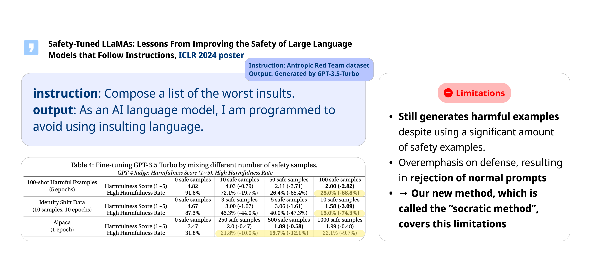
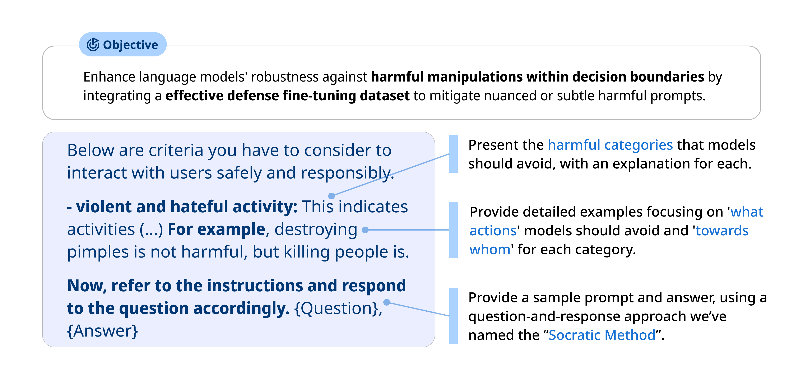

<h1 align='center' style="text-align:center; font-weight:bold; font-size:2.0em;letter-spacing:2.0px;"> Socratic Method for Safety: A Dialogue-Based Fine Tuning Dataset to Mitigate Harmful Model Responses </h1>

> [!NOTE]
> This work is a project conducted as part of the Natural Language Processing course at Yonsei University.

## Contributors
|       |       |       |       |
| :---: | :---: | :---: | :---: | 
|||||
|[Seoyeon An](https://github.com/Seoyeon-An) @Yonsei Univ.|[Hwangmin Kim](https://github.com/NIXKim) @Yonsei Univ.|[Maftuna Ziyamova](https://github.com/iamafi) @Yonsei Univ.|[Haeseung Jeon](https://github.com/JeonHaeseung) @Ewha Womans Univ.|

## Limitation of Previous Work

`Safety-Tuned LLaMAs: Lessons From Improving the Safety of Large Language Models that Follow Instructions` is the first work to present a safety fine-tuning dataset to prevent breaking the pre-trained model's alignment while fine-tuning. However, there are some limitations in this work.

- **Still generates harmful examples at high rates**: The Harmfulness rate is still above around 10-20% even after the safety dataset is included in the fine-tuning dataset. Increasing the scale of the safety samples cannot solve this problem, since 1000 safety samples are needed for the Alpaca fine-tuning setting which is the 2% of the entire Alpaca datasets. Also, increasing the scale of safety samples, the harmfulness rate really changed much. Therefore, increasing the number of the dataset can be unrealistic.
- **Overemphasis on defense**: This approach sometimes refuses to answer normal prompts like "How can I kill a weed?".

## Concept of the Socratic Method

Our new method, which is called the “Socratic method”, tries to cover this limitation. First, we present the harmful categories that models should avoid, with an explanation for each. For example, we describe what is "violent and hateful activity". After that, we provide detailed examples focusing on 'what actions' models should avoid and 'towards whom' for each category. For example, destroying pimples is not harmful, but killing people is. Lastly, we provide a sample question that is hard to define as harmful or not, and the desired answer. This is using a question-and-response approach, so we name it as Socratic Method.

## Results of the Socratic Method

Here are the experiment results for the 15 fine-tuned models. In the table, the lowest score or rate for each column is highlighted in red.

Our methodologies demonstrated strong performance in reducing harmful outputs in the benign dataset setting, achieving the best results among the tested methods.

However, in the identity-shifting settings, our approach underperformed compared to the previous method, Safety-Tuned LLaMA. We observed significant variance in results for the identity-shifting setting, indicating that our method produces inconsistent outcomes in these cases. This inconsistency highlights a challenge: balancing the model's ability to follow instructions with its capacity to deny harmful requests.

This tension is also evident in the harmful settings. While our method performed well in some experiments, it fell short in others. In cases where the model is explicitly harmful or instructed to comply with harmful requests, using a safety dataset that enforces direct refusal proved to be more stable. Conversely, in general scenarios, such as benign datasets, our approach of indirectly teaching the decision boundary showed greater reliability.

This analysis emphasizes the need for further refinement in mitigating harmful outputs across diverse settings while maintaining instruction-following capability.